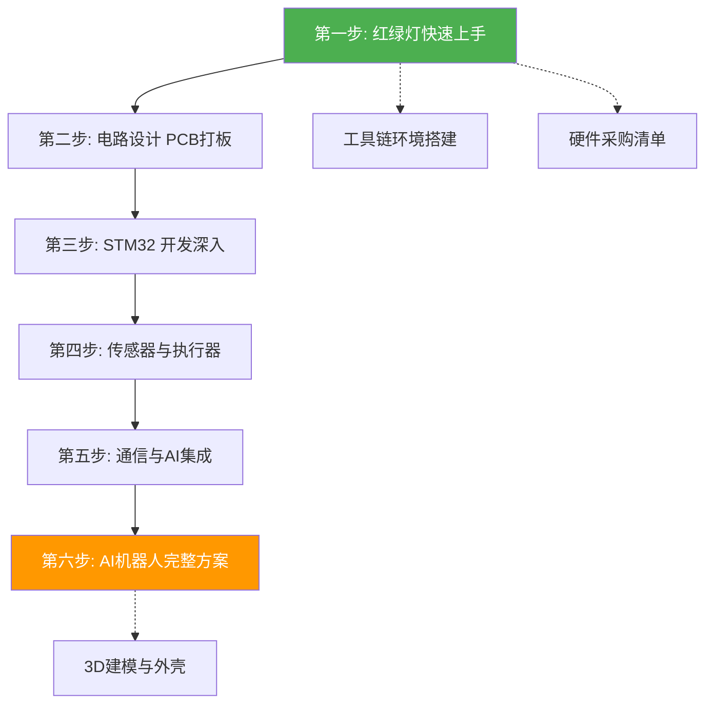

---
tags:
  - MOC
  - 嵌入式
  - 学习路线
cssclasses:
  - moc
---

# 1 嵌入式开发学习路线

> **核心理念**：项目驱动 + 从零自制。不买成品模块，从面包板接线到 PCB 打板到手焊，每个环节亲手做。
>
> **终极目标**：能独立设计并制作以 STM32 为核心的 AI 机器人，包含电路设计、PCB 打板、固件开发、AI 集成、3D 打印外壳。

---

## 1.1 学习地图

---

## 1.2 阶段总览

### 1.2.1 🟢 阶段一：红绿灯项目 — 立刻动手

**目标**：当天就让灯亮起来，快速跑通"硬件接线 → 写代码 → 烧录 → 看到效果"全流程。

- 笔记：[[01-红绿灯项目-快速上手]]
- 耗时：1~3 天
- 产出：一个能亮的三色 LED 红绿灯
- 前置：[[工具链环境搭建]]、[[硬件采购清单#第一阶段]]

### 1.2.2 🔵 阶段二：电路设计与 PCB 打板

**目标**：学会画原理图、设计 PCB、下单嘉立创打板。

- 笔记：[[02-电路设计与PCB打板]]
- 耗时：1~2 周
- 产出：红绿灯专属 PCB 板，自己手焊
- 工具：立创 EDA / KiCad / Altium Designer

### 1.2.3 🟡 阶段三：STM32 开发深入

**目标**：从"能让灯亮"到"能掌控芯片"，掌握 STM32 HAL 库核心外设。

- 笔记：[[03-STM32开发深入]]
- 耗时：2~3 周
- 产出：红绿灯升级版（串口控制 + PWM 调光）
- 环境：STM32CubeIDE + PlatformIO 双修

### 1.2.4 🟠 阶段四：传感器与执行器

**目标**：学会驱动舵机、电机、各类传感器，为机器人打基础。

- 笔记：[[04-传感器与执行器]]
- 耗时：2~3 周
- 产出：舵机云台 + 传感器数据采集系统

### 1.2.5 🟣 阶段五：通信与 AI 集成

**目标**：让单片机联网，调用 AI API，实现真正的"AI Agent 物理化身"。

- 笔记：[[05-通信与AI集成]]
- 耗时：2~3 周
- 产出：红绿灯终极版——WiFi 联网自动查询 Agent 状态、语音控制
- 涉及：ES��8266/ESP32、HTTP/MQTT、OpenCode 对接

### 1.2.6 🔴 阶段六：AI 机器人完整方案

**目标**：综合前面所有技能，设计并制作完整的 AI 机器人。

- 笔记：[[06-AI机器人完整方案]]
- 耗时：4~6 周
- 产出：STM32+ESP32 双核、多舵机、语音交互、AI 决策、3D 外壳的完整机器人

---

## 1.3 支撑笔记

| 笔记 | 说明 |
|------|------|
| [[工具链环境搭建]] | 所有开发环境安装配置 |
| [[硬件采购清单]] | 三阶段分购，按需购买不浪费 |
| [[学习资源汇总]] | B站教程、文档、开源项目 |

---

## 1.4 学习原则

1. **先跑通再优化** — 第一遍不求完美，能看到效果就是胜利
2. **遇到问题问 AI** — 硬件接线、代码报错、电路计算都可以让 AI 帮你
3. **自己做不买成品** — 面包板接线 → PCB 设计 → 手焊，每个环节都亲手做才能学会
4. **项目驱动** — 每学一个新知识点，立刻在红绿灯或机器人项目上实践
5. **做复杂的东西** — 目标不是"做玩具"，是能做真正有用的电子设备

---

## 1.5 时间估算

| 阶段 | 内容 | 时间 |
|------|------|------|
| 阶段一 | 红绿灯快速上手 | 1~3 天 |
| 阶段二 | 电路设计 PCB | 1~2 周 |
| 阶段三 | STM32 深入 | 2~3 周 |
| 阶段四 | 传感器执行器 | 2~3 周 |
| 阶段五 | 通信 AI 集成 | 2~3 周 |
| 阶段六 | AI 机器人 | 4~6 周 |
| **合计** | | **约 3~4 个月** |

每天投入 1~2 小时，周末可集中攻坚。
